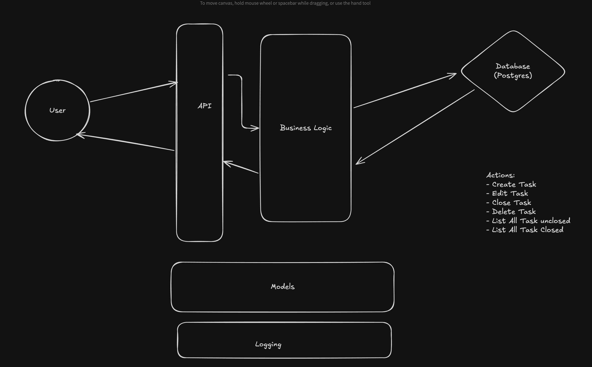

# TODO APP API

> Python 3.12+

## Dependencies
- fastapi
- uvicorn
- sqlmodel
- psycopg2-binary (Postgres Driver for db connection)
- python-multipart (for http body forms)
- pytest (Dev dependency)
- httpx (Dev dependency)

## Diagram

